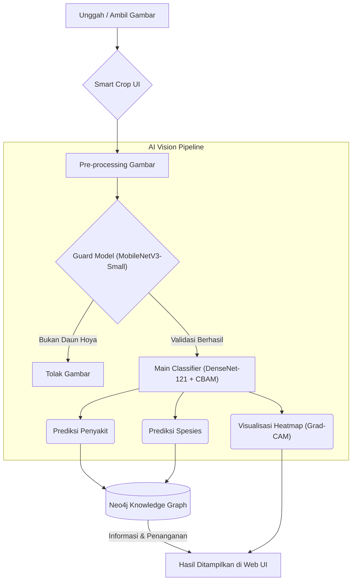

<div align="center">
  
  <h1>🍃 Hoya AI Vision</h1>
  <p><strong>Intelligent Disease Detection & Species Identification System for Hoya Plants</strong></p>

  <p>
    <a href="https://pytorch.org/"></a>
    <a href="https://flask.palletsprojects.com/"></a>
    <a href="https://neo4j.com/"></a>
    <a href="https://www.python.org/"></a>
    <a href="https://developer.mozilla.org/en-US/docs/Web/JavaScript"></a>
  </p>
  
  <i>Proyek Riset Kolaboratif MBKM (Merdeka Belajar Kampus Merdeka) — BRIN & ITERA</i>
</div>

---

## 👥 Tim Peneliti & Pengembang (MBKM)

Sistem ini dikembangkan secara kolaboratif oleh tim riset mahasiswa dari Institut Teknologi Sumatera (ITERA) di bawah bimbingan Badan Riset dan Inovasi Nasional (BRIN):

| Nama | NIM | Peran Utama (Role) | Fokus Tugas |
| :--- | :---: | :--- | :--- |
| **Feby Wulandari** | `123450042` | 📊 Dataset Collector & Optimization | Akuisisi data lapangan dan teknik augmentasi dataset gambar. |
| **Efi Defiyati** | `123450005` | 🧠 Machine Learning Engineer | Rekayasa arsitektur *Deep Learning* tingkat lanjut untuk klasifikasi. |
| **Nabyla Sharfina** | `123450008` | 🕸️ Knowledge Graph Engineer | Desain skema dan integrasi *database* grafik (Neo4j) medis tanaman. |
| **Fabio Banyu Cyto** | `123450104` | 💻 ML & Web Developer | Integrasi model ke *backend* Flask dan desain UI/UX *frontend* dinamis. |

---

## 📌 Tentang Sistem

**Hoya AI Vision** adalah aplikasi cerdas yang membantu pembudidaya dan peneliti tanaman hias mendiagnosis penyakit pada daun Hoya. Sistem ini mengadopsi pendekatan **Multitask Learning**, di mana AI mampu memprediksi **Jenis Penyakit** sekaligus **Spesies Tanaman** secara bersamaan dari satu gambar yang sama.

### ✨ Fitur Utama:
- **🛡️ Guard Model (Pencegah Noise):** Otomatis menolak gambar jika bukan daun tanaman Hoya, menjaga akurasi sistem.
- **🎯 Multitask Classification:** Satu model utama mendeteksi penyakit (seperti *Root Rot*) dan spesies Hoya secara paralel.
- **🌡️ Explainable AI (Grad-CAM):** Sistem menghasilkan *Heatmap* visual yang menunjukkan titik persis penyakit pada daun.
- **🧠 Knowledge Graph Integration:** Otomatis menarik informasi penyebab dan langkah penanganan medis dari *database* Neo4j.

---

## 🛠️ Teknologi & Bahasa Pemrograman

Sistem ini dibangun secara menyeluruh *(Full-Stack)* dengan perpaduan teknologi berikut:

### 🐍 Backend & AI (Python)
- **PyTorch & Torchvision:** Core *framework* untuk membangun dan melatih arsitektur *Deep Learning* (MobileNetV3 & DenseNet-121).
- **Flask:** *Web framework* Python yang ringan untuk melayani REST API dan *routing* aplikasi.
- **OpenCV & NumPy:** Pemrosesan manipulasi citra *(image processing)* tingkat lanjut.
- **Grad-CAM:** Algoritma untuk *Explainable AI* yang memetakan aktivasi *layer* konvolusional menjadi visualisasi *Heatmap*.

### 🕸️ Database & Data Struktur
- **Neo4j (Cypher Query Language):** Basis data graf *(Graph Database)* yang menyimpan relasi kompleks antara Spesies Hoya, Patogen/Penyakit, dan Solusi Penanganan.

### 🎨 Frontend (HTML, CSS, JS)
- **Vanilla JavaScript:** Menangani logika antarmuka pengguna yang sangat responsif, pengiriman foto *asynchronous*, dan transisi antar halaman.
- **CSS3 (Glassmorphism):** Teknik *styling* modern untuk menciptakan UI tembus pandang yang elegan dan premium.
- **Cropper.js:** *Library* manipulasi gambar langsung dari *browser* yang memungkinkan fitur *Smart Crop UI*.

---

## ⚙️ Arsitektur & Pipeline Sistem

Alur kerja (*pipeline*) dari mulai gambar diunggah hingga hasil terintegrasi dengan basis data.



### 🧠 Penjelasan Model:
- **MobileNetV3-Small:** Model pendahulu yang bertindak sebagai gerbang validasi karena sifatnya yang super ringan dan cepat.
- **DenseNet-121 + CBAM:** *Convolutional Block Attention Module* (CBAM) ditambahkan pada arsitektur DenseNet agar AI dapat memusatkan "perhatiannya" pada pola tekstur bercak penyakit yang krusial.

---

## 📂 Dataset Publik

Kami telah menyediakan dataset gabungan (gambar daun Hoya sehat dan berpenyakit) beserta teknik augmentasinya agar dapat diakses oleh publik luas di Kaggle.

🔗 **[Hoya Disease Dataset di Kaggle](https://www.kaggle.com/datasets/fabiofire/hoya-disease-dataset)**  

> **Catatan:** File dataset mentah dan bobot model berukuran besar (`.pth` >100MB) tidak disertakan di GitHub demi menjaga efisiensi ukuran repositori.

---

## 🚀 Cara Menjalankan Secara Lokal

1. **Kloning repositori ini:**
   ```bash
   git clone https://github.com/fabiobanyu/MBKM-Hoya-Leaf-Disease-Detection.git
   cd MBKM-Hoya-Leaf-Disease-Detection
   ```
2. **Install dependensi library Python:**
   ```bash
   pip install -r requirements.txt
   ```
3. **Konfigurasi Neo4j (Knowledge Graph):**
   - Pastikan layanan Neo4j Desktop berjalan di latar belakang.
   - Sesuaikan kredensial (URI, Username, Password) di file `Backend/Backend.py`.
4. **Jalankan Aplikasi Server:**
   ```bash
   python Backend/Backend.py
   ```
   Aplikasi dapat diakses melalui browser kesayangan Anda di `http://127.0.0.1:5000`
