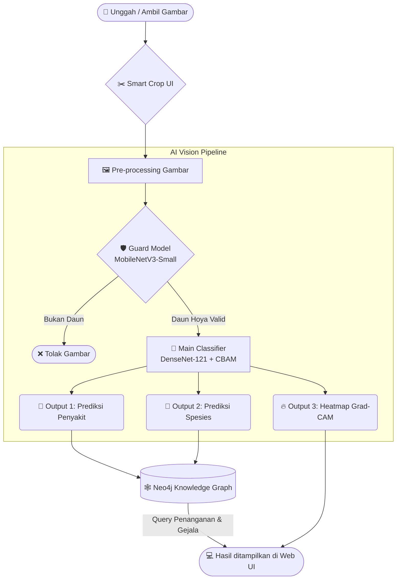

<div align="center">
  
  <h1>🍃 Hoya AI Vision</h1>
  <p><strong>Intelligent Disease Detection & Species Identification System for Hoya Plants</strong></p>

  <p>
    <a href="https://pytorch.org/"></a>
    <a href="https://flask.palletsprojects.com/"></a>
    <a href="https://neo4j.com/"></a>
    <a href="https://developer.mozilla.org/en-US/docs/Web/JavaScript"></a>
  </p>
  
  <i>Proyek Riset Kolaboratif MBKM (Merdeka Belajar Kampus Merdeka) — BRIN & ITERA</i>
</div>

---

## 👥 Tim Peneliti & Pengembang (MBKM)

Sistem ini dikembangkan secara kolaboratif oleh tim riset mahasiswa dari Institut Teknologi Sumatera (ITERA) di bawah bimbingan Badan Riset dan Inovasi Nasional (BRIN):

| Nama | NIM | Peran Utama (Role) | Fokus Tugas |
| :--- | :---: | :--- | :--- |
| **Feby Wulandari** | `123450042` | 📊 Dataset Collector & Optimization | Akuisisi data lapangan dan teknik augmentasi dataset gambar. |
| **Efi Defiyati** | `123450005` | 🧠 Machine Learning Engineer | Rekayasa arsitektur *Deep Learning* tingkat lanjut untuk klasifikasi. |
| **Nabyla Sharfina** | `123450008` | 🕸️ Knowledge Graph Engineer | Desain skema dan integrasi *database* grafik (Neo4j) medis tanaman. |
| **Fabio Banyu Cyto** | `123450104` | 💻 ML & Web Developer | Integrasi model ke *backend* Flask dan desain UI/UX *frontend* dinamis. |

---

## 📌 Tentang Sistem

**Hoya AI Vision** adalah aplikasi cerdas yang membantu pembudidaya dan peneliti tanaman hias mendiagnosis penyakit pada daun Hoya. Sistem ini mengadopsi pendekatan **Multitask Learning**, di mana AI mampu memprediksi **Jenis Penyakit** sekaligus **Spesies Tanaman** secara bersamaan dari satu gambar yang sama.

### ✨ Fitur Utama:
1. **🛡️ Guard Model (Pencegah *Noise*):** Memfilter gambar yang dimasukkan, otomatis menolak gambar jika bukan daun tanaman Hoya.
2. **🎯 Multitask Classification:** Satu model utama memprediksi kelas penyakit (contoh: *Root Rot*, *Rust*) dan spesies Hoya secara paralel.
3. **🌡️ Explainable AI (Grad-CAM):** Sistem menghasilkan *Heatmap* Peta Panas visual yang membuktikan area daun mana yang menyebabkan AI mendiagnosis penyakit tersebut.
4. **🧠 Knowledge Graph Integration:** Terhubung dengan *database* Neo4j untuk menarik informasi komprehensif, penyebab, dan langkah penanganan cerdas.

---

## ⚙️ Arsitektur & Pipeline Sistem

Alur kerja (pipeline) sistem dirancang untuk memastikan akurasi dan kecepatan, dari pengguna mengunggah gambar hingga mendapat penanganan dari Knowledge Graph.



### 🧠 Penjelasan Model:
- **MobileNetV3-Small:** Digunakan sebagai *Guard Model* karena sangat ringan dan cepat, dioptimalkan untuk perangkat *mobile* untuk klasifikasi biner sederhana (Daun Hoya vs Bukan).
- **DenseNet-121 + CBAM:** *Convolutional Block Attention Module* (CBAM) ditambahkan pada arsitektur DenseNet agar AI dapat lebih fokus membedakan tekstur bercak penyakit tanpa tertukar dengan corak unik daun Hoya.

---

## 📂 Dataset Publik

Untuk mendorong perkembangan riset lanjutan pada botani cerdas, dataset gambar daun Hoya (sehat dan berpenyakit) beserta teknik augmentasinya yang kami gunakan tersedia secara publik di Kaggle.

🔗 **[Hoya Disease Dataset di Kaggle](https://www.kaggle.com/datasets/fabiofire/hoya-disease-dataset)**  
*(Oleh: Fabio Banyu Cyto, dkk)*

> **Catatan:** File dataset mentah dan bobot model berukuran besar (`.pth` >100MB) sengaja tidak di-*push* ke repositori GitHub ini untuk menjaga kebersihan dan efisiensi riwayat Git.

---

## 🚀 Cara Menjalankan Secara Lokal

1. **Clone repositori ini:**
   ```bash
   git clone https://github.com/fabiobanyu/MBKM-Hoya-Leaf-Disease-Detection.git
   cd MBKM-Hoya-Leaf-Disease-Detection
   ```
2. **Install Dependensi:**
   ```bash
   pip install -r requirements.txt
   ```
3. **Konfigurasi Neo4j (Knowledge Graph):**
   - Pastikan Neo4j Desktop berjalan di latar belakang.
   - Sesuaikan kredensial (URI, Username, Password) di file `Backend/Backend.py`.
4. **Jalankan Aplikasi:**
   ```bash
   python Backend/Backend.py
   ```
   Aplikasi dapat diakses melalui browser di `http://127.0.0.1:5000`
